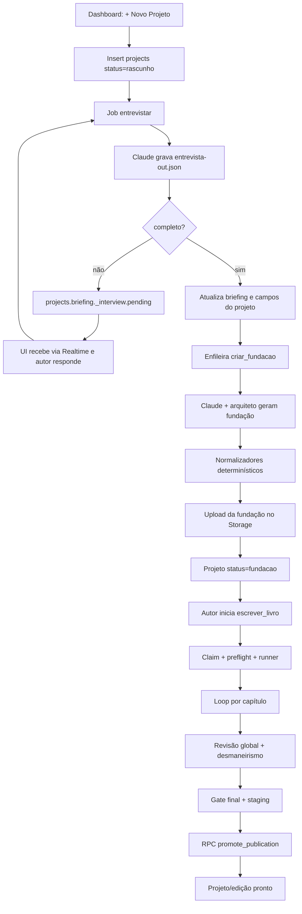
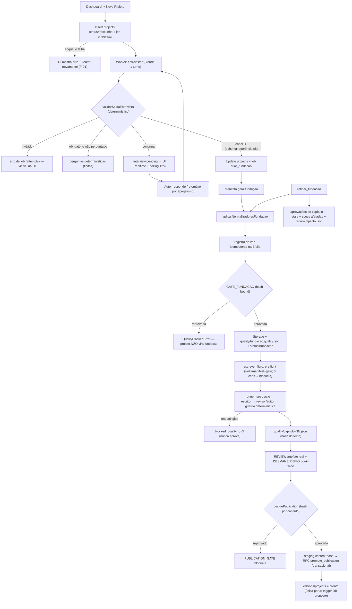

# Auditoria end-to-end — Novo Projeto até publicação

- Data de início: 2026-07-11
- Goal: ativo
- Commit de baseline: `aba4af23dfd002d45fe86c37c2968f8c0d0d170a`
- Branch: `master`
- Escopo: UI, entrevista, fundação, refino, escrita, revisão, publicação,
  sincronização, retomada, concorrência, segurança e observabilidade.

## Proteção do ambiente

- `graphify-out/` já existia sem rastreamento e permanece fora do escopo.
- Um `escrever_livro` real está `running` no projeto
  `53abdade-554d-47e2-bd14-955de3ffc41e`, capítulo 37/60.
- Outros três jobs de escrita estão `queued`.
- O worker usa `tsx watch src/index.ts`; editar módulos carregados pode reiniciá-lo.
  Enquanto houver subprocesso editorial ativo, a auditoria nesses módulos é somente leitura.
- Nenhum manuscrito real será usado como massa de teste nem reescrito pela auditoria.

### Revalidação 2026-07-12

- `worker_control.enabled=false` desde 2026-07-12T16:10Z — produção pausada pelo dono.
- Nenhum job `running` nem `locked_by` no banco; os dois livros ativos estão `paused`
  com `blocked_quality` (GATE_CAPITULO): `53abdade` ("O Índice dos Abduzidos",
  blockers de cadência) e `cae6a074` ("A Herdeira do Cemitério de Flores",
  "molde fragmento antitetico 3x").
- Dois `escrever_livro` `queued` desde 2026-06-28 (vol. 2 e 3 de "A Biblioteca
  Afogada") com `retry_at` vencido há 14 dias — candidato a achado de fila (F-10).
- Conclusão operacional: edição de código do worker é segura neste momento;
  manuscritos reais continuam intocáveis.

## Baseline comprovado

| Evidência | Resultado |
|---|---|
| Git | `master`, HEAD `aba4af2`, apenas `graphify-out/` preexistente |
| Runner no repositório | SHA-256 `2cb01eb92e05ac3eefb3dd869208f1b22afddad0d8198b2b790665778480741f` |
| Runner instalado | mesmo SHA-256 |
| Manifest | versão 1.0.0 |
| Testes | 38 arquivos, 351 testes aprovados |
| Lint | 0 erros, 3 warnings de Fast Refresh |
| Build | aprovado; bundle principal acima de 500 kB |
| Typecheck worker | aprovado |
| Python/paridade | pyflakes limpo; 3 fixtures comuns aprovadas |
| Diff | `git diff --check` aprovado |

## Fluxo atual — hipótese extraída do código

Este diagrama é provisório. Cada aresta será substituída por contrato, pós-condição,
teste e recuperação comprovados na matriz de rastreabilidade.

## Fluxo comprovado (depois das correções de 2026-07-12)

## Evidência end-to-end (2026-07-12)

Projeto efêmero `AUDIT-CODEX-NEW-PROJECT-20260712` (`9c9a2258`), criado pela UI
publicada com sessão real; jobs executados pelo harness `audit-run-job.ts`
(claim via RPC; produção global permaneceu pausada — nenhum job real rodou):

1. criação na UI → projeto rascunho + job entrevistar (comprovado no banco);
2. 5 turnos de entrevista reais (Claude), 4 blocos na UI: resposta livre (autor),
   recomendações, opções; 12 respostas = exatamente o teto;
3. conclusão passou pelo validador novo: cobertura dos 5 obrigatórios,
   briefing coerente (14 caps × piso 1400 ≤ 66.000 palavras; 300 palavras/página;
   skill-jk-rowling válida); `entrevista-out.json` no WORK_DIR com `completo:true`;
4. `criar_fundacao` enfileirada automaticamente e RETIDA na fila
   (worker_control.enabled=false) — bloqueio de execução comprovado;
5. UI navegou para a página do projeto ("Fundação validada!").

### Rodada 2 (2026-07-12/13): fundação real + 1 capítulo + limpeza — CONCLUÍDOS

- **Fundação real**: 1ª execução BLOQUEADA pelo gate (`AGENTE_AUSENTE:*` — achado
  A18); retry com autocura APROVADA: 5 agentes instalados do staging, modelos
  pinados, craft injetada, `GATE_FUNDACAO approved` 0 blockers, Estrutura 14 ==
  ESTADO 14, hash agregado `9aca6fb8…`; projeto `fundacao`; Storage com 7
  arquivos (incl. `fundacao.quality.json`).
- **1 capítulo real** (runner com parada limpa `_PARAR_APOS_CAP`, instalado =
  versionado, sha256 `49c168a4…`): runner.log — "Capitulo 1 revisado (delegado)
  -> aceito. cadencia excesso 0->0; piso ok; ledger ok." + "PARADA LIMPA …
  rc=0"; `capitulo-01.md` 2.583 palavras sha256
  `086a4bf2539ea7873c3754e23d25aa144d343f2e2015090f9bbf868b2b0a01c0`;
  `quality/capitulo-01.json` **approved** com `textHash` IGUAL ao hash do
  arquivo (aprovação pertence ao texto atual); métricas 0 excessos; job `done`
  com progresso "cap 1/14"; **retomada idempotente**: novo `escrever_livro`
  re-enfileirado automaticamente e retido pela pausa; `chapters` upsertado
  (numero=1, 2.583 palavras) e `capitulo-01.md` (14.320 B) no Storage; capítulo
  **renderizado na plataforma publicada** (Leitor: "A hesitação", sumário
  1 capítulo, sem meta-texto). Edição permaneceu `escrevendo` — publicação
  parcial impossível comprovada em produção.
- **Limpeza PROVADA** (`audit-cleanup.ts --confirm`): antes 1 projeto/9 jobs/1
  edição/1 capítulo/Storage 1+7; depois 0 em tudo, WORK_DIR removido, 0
  projetos AUDIT-* restantes; dados reais intactos.
- Achado A20 corrigido no percurso: `criar_fundacao` sobrescrevia o título e
  apagava a marcação `AUDIT-` (guarda adicionada — título gerado vira sufixo).

## Pendências que mantêm o goal ATIVO (após rodada 2)

- **DDL pendente de autor** (única via é o dashboard — sem CLI/connection
  string e login não é contornável): aplicar `supabase/reliability.sql`
  conforme `docs/audits/APLICAR-RELIABILITY-SQL.md` (snapshot → aplicar →
  verificação → testes negativos). Estado ANTES já provado: insert duplicado
  de job queued ACEITO (índice ausente).
- ~~Percurso real fundação→capítulo~~ CONCLUÍDO (rodada 2, acima).
- ~~Sincronizar runner instalado~~ CONCLUÍDO (hash idêntico `49c168a4…`,
  backup em `skill-backups/20260712220816`).
- Deploy do frontend: commit+push desta rodada; verificar na URL publicada.

## Achados (classificados)

| # | Sev | Achado | Estado |
|---|---|---|---|
| A1 | P1 | Entrevista concluía sem validação (`completo:true` com briefing vazio atualizava projeto e disparava fundação); prompt dizia "4" enumerando 5; teto forçava conclusão | corrigido (`entrevista.ts`, 21 testes) |
| A2 | P1 | Fundação aprovada só por existência de 2 arquivos + total>0; sem coerência cruzada, sem Quality State | corrigido (`fundacao-gate.ts`, 19 testes) |
| A3 | P1 | Refino não re-rodava normalizadores nem invalidava aprovações/specs | corrigido (7 testes) |
| A4 | P2 | VOZ-CONSISTENCIA: aviso eterno exigindo marcador manual apesar da injeção determinística | corrigido (auto-registro idempotente auditável) |
| A5 | P1 | Escrita iniciava apenas com `ESTADO_LIVRO.json` presente (sem gate) | corrigido (preflight bloqueia início; retomada com aviso) |
| A6 | P2 | Enqueue falho = spinner eterno; refresh perdia a entrevista; erro de job invisível; fundação gerável com entrevista incompleta | corrigido (UI; validar pós-deploy) |
| A7 | P2 | Starvation na fila (prioridade sem aging); "Produzir agora" podia matar jobs de fome | corrigido (`prioridadeEfetiva`) |
| A8 | P2 | Corrida de enqueue duplicado (check-then-insert sem constraint) | corrigido no SQL (DDL pendente) |
| A9 | P2 | `editions.status='pronto'` gravável por cliente com sessão do owner (sem guarda no banco) | corrigido no SQL (DDL pendente) |
| A10 | P2 | Dashboard mostrava "Escrevendo" para livro `blocked_quality` (execução fantasma); "concluído" com 1/34 | corrigido (`displayProjectStatus.qualityBlocked` + rótulos) |
| A11 | P2 | Prompt injection: ideia/respostas do autor sem cerca no prompt (mitigado por acceptEdits+validador) | corrigido na entrevista (cerca); briefing.md do arquiteto segue sem cerca (residual P3) |
| A12 | P2 | Projetos antigos sem Quality State ficavam impublicáveis sem caminho de migração | corrigido (backfill honesto, nunca aprova) |
| A13 | P3 | Comentários do runner diziam "teto aceita" (código bloqueia) | corrigido (comentários) |
| A14 | P3 | Jobs queued de projeto pausado exibem "aguardando reset do Max" mascarando a pausa | pendente (registrado) |
| A15 | P3 | `worker/audit-backup/` com conteúdo privado dentro do repo (gitignored); buckets `public=false` a confirmar no console; segmentos "humanos" de path fora da guarda em alguns pontos | pendente (registrado) |
| A16 | P3 | `recuperarOrfaos`/`processamentoAtivo`/`enfileirarEscritaSeNovo` sem testes | pendente (dívida) |
| A17 | P3 | EPUB↔mestre não comparado por hash no gate final (EPUB_STALE heurístico) | pendente (melhoria proposta) |

Anomalia investigada e explicada (não-bug): 2 jobs `queued` havia 14 dias eram
efeito de `producao_pausada=true` nos volumes 2-3 da Biblioteca Afogada
(verificado no banco) — recurso intencional, mas mascarado na UI (A14).

### Achados da rodada 3 (diagnóstico de convergência, 2026-07-13)

Autópsia do caso real `cae6a074` cap-02 (bloqueado com "molde fragmento
antitetico 3x"). Tabela iteração×métrica no TEST-LEDGER ciclo 9.

| # | Sev | Achado | Estado |
|---|---|---|---|
| A21 | P1 | **Contador com falso positivo dominante**: a regra "fragmento antitetico" (`Não <≤45 chars>. <Maiúscula>`) contava QUALQUER frase curta iniciada por "Não" sem exigir antítese — 4/5 marcações no estado real eram voz legítima de narradora 1ª pessoa (hoover-mcfadden): "Não é pergunta.", "Não sei o que foi aquele instante.", "Não conheço esta letra.", "Não há borrão: trinta e um."; a única antítese real ("Não é o velho de antes. Este é mais novo") estava DENTRO do budget 1. O escritor não era a causa: reduziu 8→3 e zerou 6 das 7 famílias em uma passada, julgando (corretamente) as restantes como legítimas | corrigido — regex exige 2º termo antitético (Era/É/Este/Havia/Mas/…), espelhada TS+Python; 6 fixtures da autópsia no contrato de paridade (`quality-parity.json` v1.1.0) |
| A22 | P1 | **Instrução de correção genérica**: o prompt do gate listava só regra+contagem (docstring prometia "nomeia as linhas" mas não nomeava) — o corretor não sabia QUAIS frases a regex contava | corrigido — `_ocorrencias_exatas`: prompt ganha lista (linha, regra, "trecho") com ordem de editar SOMENTE esses trechos; o relatório de bloqueio (`restantes`/quality_blockers) agora nomeia as frases exatas para decisão autoral |
| A23 | P1 | **Flag `quality_status=blocked_quality` nunca era limpo em run novo**: um run retomado que progredisse ainda seria re-bloqueado pelo worker ao reler o flag stale do ESTADO | corrigido — início do run limpa o flag (o run reavalia pela verdade do disco) |
| A24 | — | **Premissa de vazamento REFUTADA**: "[correcao executada, mas a recontagem continuou reprovada]" NÃO está em nenhum manuscrito (auditar-vazamentos no acervo: "Nenhum vazamento encontrado ✓"; grep local+Storage: 0; o cap-02 bloqueado nem subiu ao Storage). A string existe só em `quality_reason` e aparece na UI como painel de status do job ao lado do conteúdo — informação operacional, não meta-texto no livro | sem correção necessária (lockdown intacto) |

**Prova de outcome (FASE 4)**: com o contador corrigido, o cap-02 real
(hash `7b24acd6…`, texto INALTERADO) passou o gate completo re-executado —
moldes [], muletas [], cadência [], repetições 0 → **APROVADO**, ledger
atualizado. Iterações: 8x → 3x (correção real do agente) → 1 real ≤ budget
(recontagem honesta). Runner instalado ressincronizado (`bb5feccb…`).

Escopo honesto: o outro livro bloqueado (`53abdade`) reprova por regras de
CADÊNCIA (anáfora/fragmento de ênfase) — família diferente, não auditada
nesta rodada; os fixes A22 (instrução cirúrgica p/ moldes/muletas) e A23
(flag stale) também o beneficiam, mas seus contadores não foram classificados
caso a caso.

### Achados da rodada 2 (E2E real da fundação, 2026-07-12)

| # | Sev | Achado | Estado |
|---|---|---|---|
| A18 | P1 | Sessão headless com `.claude/` bloqueado faz o arquiteto gravar os agentes em `_agentes-para-instalar/` (staging + LEIA-ME); antes do gate isso passava em silêncio e o projeto nascia SEM agentes instalados. **O gate novo bloqueou na primeira execução real** (`AGENTE_AUSENTE:*` — evidência em quality/fundacao.quality.json do projeto AUDIT) | corrigido — `instalarAgentesDeStaging` (determinístico, idempotente, nunca sobrescreve) roda antes dos normalizadores em criar/refinar/preflight; testes em `fundacao-refino.test.ts` |
| A19 | P3 | Parser de capítulos da Estrutura não reconhecia o formato abreviado real do arquiteto (`### Cap. N — …`) — check de coerência virava warning míope | corrigido — regex calibrada com o artefato real; teste com fixture do formato do mundo |

